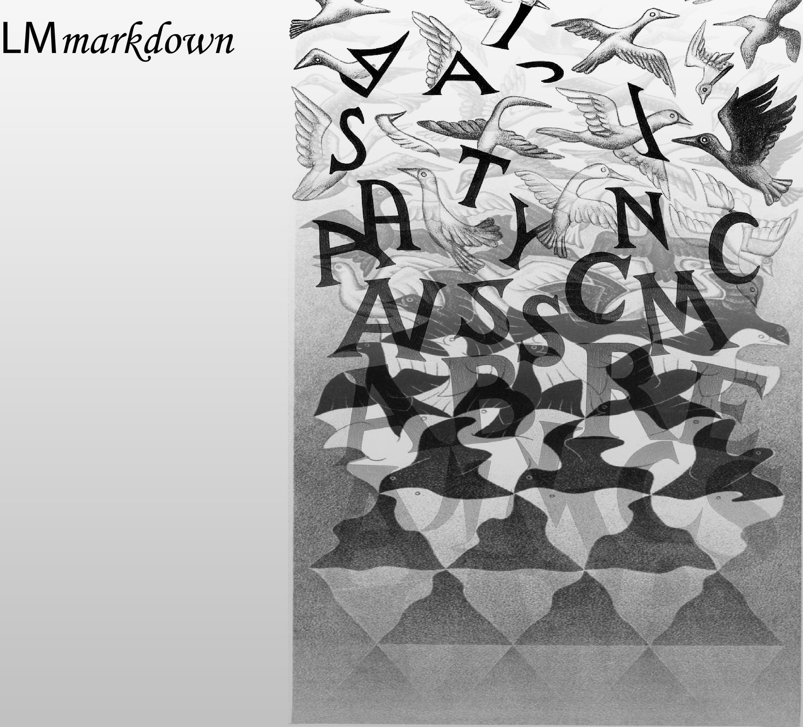

# Welcome to Language Models Markdown

Markdown is a versatile format that may be used to create web-page content, as well as slides, reports, or even books. LM Markdown extends standard Markdown in two ways. 

* it enables the interaction with a language model from within the markdown text, in the guise of a "co-pilot". See the [handbook](Handbook/Interaction.md) manual for examples.

* it extends the range of artefacts that may be created from the markdown file with _LM artefacts_, i.e. textual applications with a language model as the engine of textual processing. See the [RAG section](Handbook/PrepareRAG.md) of the handbook for details.

In LM Markdown, the interaction with language models takes place through _metadata_ that can be interspersed with text and headings at any level of granularity. Metadata blocks can be used to annotate text, store properties of text extracted with language models, or simply to interact with language models to quality-proof and revise text. The philosophy of LM Markdown is to allow users to interact at any stage of the AI-driven production of text irrespective of their expertise in programming.

## LM Markdown to convert markdown files to vector databases

The simplest LM artefact we can think of is a _RAG server_. LM markdown includes the basic building blocks to allow users to author a RAG application: instead of converting the markdown file to a Web file, it is converted to a database. The difference with the classic RAG setup is that LM markdown allows users to actively interact with the language model and explore ways of encoding the meaning of text prior to ingesting the data in the database when working at the level of the markdown text. LM markdown supports _graph RAG_ by leveraging the hierarchical nature of documents, where communal content is identified at different levels of granularity by the hierarchy of headings in the document, and transversally through metadata annotating text blocks or the text under headings.

While RAG is most often used to make available the content of throusand of documents, LM markdown addresses a completely different need: that of users who want to _author_ a RAG application, exploiting a tight feedback loop with language models. In the former case, RAG ingests gigabytes of data somewhat blindly. In LM markdown, by cotrast, the idea is one of allowing RAG authors to curate their content as carefully as they need.

## LM Markdown as an API for textual analysis and data extraction

Because LM Markdown is an API, it may be used by data scientist to develop a pipeline to extract information from semi-structured content, such as research reports or papers. In this application, the data scientist can directly use and supplement the LM Markdown API with specific prompts or functions to support bespoke analysis pipelines.
